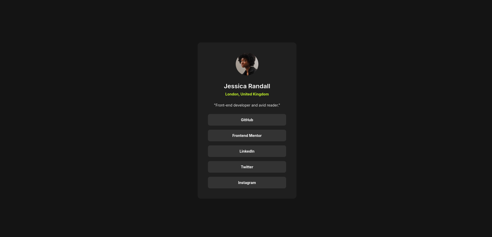

# Frontend Mentor - Social Links Profile solution

This is a solution to the [Social Links Profile challenge on Frontend Mentor](https://www.frontendmentor.io/challenges/social-links-profile-UG32l9m6dQ). Frontend Mentor challenges help you improve your coding skills by building realistic projects. 

## Table of contents

- [Overview](#overview)
  - [The challenge](#the-challenge)
  - [Screenshot](#screenshot)
  - [Links](#links)
- [My process](#my-process)
  - [Built with](#built-with)
  - [What I learned](#what-i-learned)
  - [Continued development](#continued-development)
  - [AI Collaboration](#ai-collaboration)
- [Author](#author)

## Overview

### The challenge

Users should be able to:

- See hover and focus states for all interactive elements on the page

### Screenshot



### Links

- Solution URL: [GitHub Repository](https://github.com/Kking927/Social-Links-Profile)
- Live Site URL: [Live Site](https://kking927.github.io/Social-Links-Profile/)

## My process

### Built with

- Semantic HTML5 markup
- CSS custom properties
- Flexbox
- Mobile-first workflow
- CSS Keyframe Animations

### What I learned

**Design Estimation & Planning:**
I improved my ability to create a pixel-perfect design without relying on Figma. I used browser measurement tools to estimate spacing, font sizes, and layout proportions from the example image. I also found that mapping out my CSS variables for things like colors and gaps before I even started coding made the whole process much faster and kept the project organized.

**Color Matching & Effects:**
I learned how to effectively match a "glow" or shadow effect to a specific primary color. By using `hsla` for the glow variable, I was able to maintain the hue and saturation of the primary green while controlling the transparency to create a cohesive hover effect.

```css
.social-link:hover {
  box-shadow: 0 0 15px hsla(75, 94%, 57%, 0.4);
}
```

**Advanced Animations:**

I expanded my knowledge of CSS Keyframes by implementing a "subtle settle" animation. This involved using a `cubic-bezier` timing function and staggered animation delays to make the entrance feel more natural and smooth.

### Continued development

In future projects, I plan to:

- **Refine Animation Best Practices:** I want to dive deeper into when and how to use animations effectively so they enhance the user experience without becoming a distraction.
- **Master CSS Keyframes:** I plan to experiment with more complex multi-step animations and how to combine them with transitions for interactive elements.
- **Explore CSS Clamp:** I want to move toward more fluid typography that scales perfectly between mobile and desktop without needing as many media queries.

### AI Collaboration

I used Gemini AI to help fine-tune these visual details and animations for this project:

- **Color Precision:** I worked with the AI to calculate the exact `hsla` values for the interactive glow effects. This helped me keep the branding consistent while adding a subtle "light-up" feel to the hover states.
- **Animation Logic:** I used the AI to help refine the timing and staggered delays for the CSS keyframes, making the entrance of the social links feel smooth and polished.

### Author

- Frontend Mentor - [@Kking927](https://www.frontendmentor.io/profile/Kking927)
